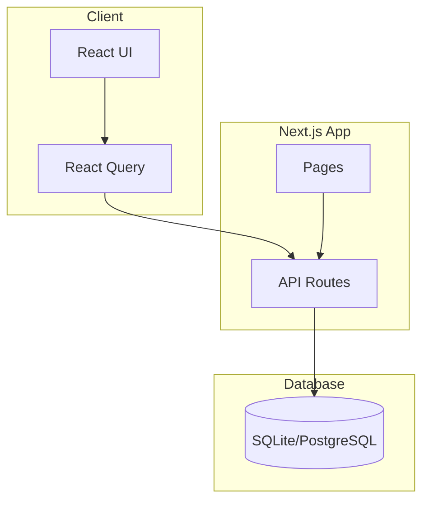
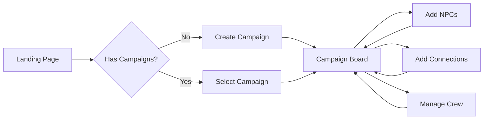

# NPC Graph - Relationship Manager

A web application for managing and visualizing NPC (Non-Playable Character) relationships for tabletop RPG campaigns. Features a detective board-style visualization, campaign management, and crew/party tracking.

## Features

- 🗺️ **Campaign Management** - Organize NPCs and relationships by campaign
- 🕵️ **Detective Board** - Investigation board with draggable photo nodes and yarn connections
- 👥 **Built-in Crew System** - Each campaign includes a party/crew with customizable members
- 🔍 **Advanced Filtering** - Filter by faction, location, status, and relationship types
- 👤 **NPC Management** - Add, edit, and delete NPCs with detailed information
- 🔗 **Relationship Tracking** - Create relationships between NPCs with types and strengths
- 🔐 **Role-Based Access** - Viewer, Editor, and Admin roles
- 💾 **Persistent Storage** - SQLite (local) or PostgreSQL (production)
- 🐳 **Docker Support** - Run everything in containers

## Architecture



## Data Model

```mermaid
erDiagram
    Campaign ||--o| Crew : has
    Campaign ||--o{ Npc : contains
    Crew ||--o{ CrewMember : has
    Crew ||--o{ CrewRelationship : has
    CrewMember ||--o{ CrewMemberRelationship : has
    Npc ||--o{ Relationship : from
    Npc ||--o{ Relationship : to
    
    Campaign {
        string id PK
        string name
        string description
        boolean isActive
    }
    
    Crew {
        string id PK
        string name
        string campaignId FK
    }
    
    CrewMember {
        string id PK
        string name
        string title
        string crewId FK
    }
    
    Npc {
        string id PK
        string name
        string title
        string faction
        string location
        string status
        string campaignId FK
    }
    
    Relationship {
        string id PK
        string fromNpcId FK
        string toNpcId FK
        string type
        int strength
    }
```

## Quick Start with Docker

```bash
# Start the application
docker-compose up --build

# The app will be available at http://localhost:3000
```

## User Flow



## Project Structure

```
npc-graph/
├── src/
│   ├── app/
│   │   ├── api/
│   │   │   ├── campaigns/      # Campaign CRUD
│   │   │   ├── npcs/           # NPC CRUD
│   │   │   ├── relationships/  # Relationship CRUD
│   │   │   ├── crews/          # Crew management
│   │   │   └── graph/          # Graph data endpoint
│   │   ├── campaign/[id]/      # Campaign board page
│   │   ├── layout.tsx
│   │   └── page.tsx            # Campaign selection
│   ├── components/
│   │   ├── detective/
│   │   │   ├── CampaignBoard.tsx     # Main board with campaign context
│   │   │   ├── DetectiveBoard.tsx    # Draggable photo board
│   │   │   ├── DetectiveFilterPanel.tsx
│   │   │   ├── DetectiveLegend.tsx
│   │   │   └── DetectiveNpcPanel.tsx
│   │   ├── NpcForm.tsx
│   │   ├── RelationshipForm.tsx
│   │   └── Providers.tsx
│   ├── hooks/
│   │   └── useApi.ts           # React Query hooks
│   ├── lib/
│   │   └── prisma.ts
│   └── types/
│       └── index.ts
├── prisma/
│   ├── schema.prisma           # Database schema
│   └── seed.ts
├── Dockerfile
├── docker-compose.yml
└── package.json
```

## API Endpoints

### Campaigns
| Method | Endpoint | Description |
|--------|----------|-------------|
| GET | `/api/campaigns` | List all campaigns |
| POST | `/api/campaigns` | Create campaign (with crew) |
| GET | `/api/campaigns/:id` | Get campaign details |
| PUT | `/api/campaigns/:id` | Update campaign |
| DELETE | `/api/campaigns/:id` | Delete campaign |
| GET | `/api/campaigns/:id/graph` | Get campaign graph data |

### NPCs
| Method | Endpoint | Description |
|--------|----------|-------------|
| GET | `/api/npcs` | List all NPCs |
| POST | `/api/npcs` | Create NPC |
| GET | `/api/npcs/:id` | Get NPC details |
| PUT | `/api/npcs/:id` | Update NPC |
| DELETE | `/api/npcs/:id` | Delete NPC |

### Relationships
| Method | Endpoint | Description |
|--------|----------|-------------|
| GET | `/api/relationships` | List relationships |
| POST | `/api/relationships` | Create relationship |
| PUT | `/api/relationships/:id` | Update relationship |
| DELETE | `/api/relationships/:id` | Delete relationship |

### Crews
| Method | Endpoint | Description |
|--------|----------|-------------|
| GET | `/api/crews` | List all crews |
| GET | `/api/crews/:id` | Get crew details |
| POST | `/api/crews/:id/members` | Add crew member |

## Relationship Types

| Type | Color | Description |
|------|-------|-------------|
| Friend | 🟢 Green | Friendly relationship |
| Enemy | 🔴 Red | Hostile relationship |
| Family | 🟣 Purple | Family connection |
| Ally | 🔵 Blue | Strategic alliance |
| Rival | 🟠 Orange | Competitive relationship |
| Romantic | 💗 Pink | Romantic relationship |
| Business | 🟡 Yellow | Business/trade |
| Mentor | 🩵 Teal | Teacher/student |
| Servant | ⚫ Gray | Service relationship |

## Tech Stack

- **Framework**: Next.js 16 (App Router with Turbopack)
- **Database**: SQLite (dev) / PostgreSQL (prod) + Prisma ORM
- **State**: TanStack Query (React Query)
- **Styling**: Tailwind CSS + Custom detective theme
- **Container**: Docker

## Development

```bash
# Install dependencies
npm install

# Generate Prisma client
npx prisma generate

# Create database
npx prisma db push

# Seed sample data
npm run db:seed

# Start dev server
npm run dev
```

## Future Enhancements

- [ ] Full authentication with NextAuth.js
- [ ] Export/Import data (JSON/CSV)
- [ ] Image upload for NPC portraits
- [ ] Collaborative real-time editing
- [ ] Timeline view for relationship changes
- [ ] Mobile-responsive design and touch support
- [ ] Zoom in/out controls for board navigation
- [x] Campaign management system
- [x] Detective board visualization
- [x] Crew management with members
- [x] Crew member navigation

## License

MIT
