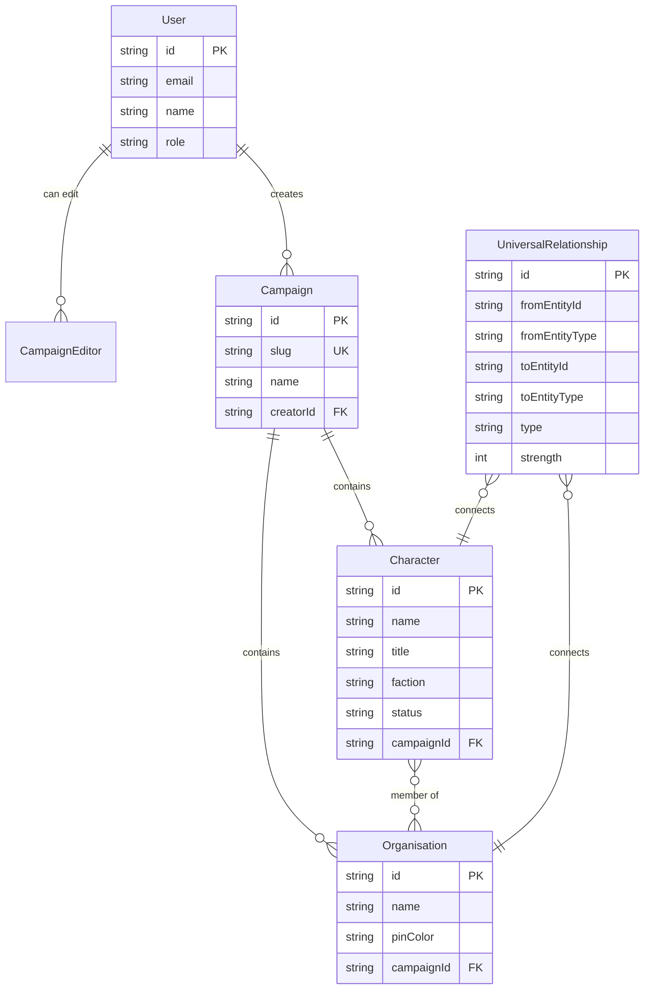

# Character Web - Relationship Manager

A web application for managing and visualizing character relationships for tabletop RPG campaigns. Features a detective board-style visualization, campaign management, and organisation tracking.

## Features

- 🗺️ **Campaign Management** - Organize characters and relationships by campaign
- 🕵️ **Detective Board** - Investigation board with draggable photo nodes and yarn connections
- 🏛️ **Organisation System** - Group characters into organisations with customizable colors
- 🔍 **Advanced Filtering** - Filter by faction, location, status, and relationship types
- 👤 **Character Management** - Add, edit, and delete characters with detailed information
- 🔗 **Relationship Tracking** - Create relationships between any entities with types and strengths
- 📱 **Mobile-First Design** - Touch gestures, long-press multi-select, bottom sheet details
- 🔐 **Role-Based Access** - Viewer, Editor, and Admin roles
- 💾 **Persistent Storage** - SQLite (local) or PostgreSQL (production with Neon)
- 🐳 **Docker Support** - Run everything in containers
- ☁️ **Azure Deployment** - Ready for Azure Container Apps
- 📸 **Image Upload** - Azure Blob Storage integration with cropping support

## Environment Variables

| Variable | Description | Required |
|----------|-------------|----------|
| `DATABASE_URL` | PostgreSQL connection string (pooled) | Yes (prod) |
| `DIRECT_URL` | PostgreSQL direct connection for migrations | Yes (prod) |
| `NEXTAUTH_URL` | Base URL for authentication (e.g., `http://localhost:3000`) | Yes |
| `NEXTAUTH_SECRET` | Secret for encrypting session tokens | Yes |
| `ENTRA_TENANT_ID` | Microsoft Entra tenant ID | For MS auth |
| `ENTRA_CLIENT_ID` | Microsoft Entra app client ID | For MS auth |
| `ENTRA_CLIENT_SECRET` | Microsoft Entra app client secret | For MS auth |
| `GOOGLE_CLIENT_ID` | Google OAuth client ID | For Google auth |
| `GOOGLE_CLIENT_SECRET` | Google OAuth client secret | For Google auth |
| `AZURE_STORAGE_CONNECTION_STRING` | Azure Blob Storage connection | For images |
| `AZURE_STORAGE_CONTAINER_NAME` | Blob container name (default: `npc-images`) | For images |

## Authentication

Character Web supports multiple authentication providers:
- **Microsoft** - Sign in with Microsoft accounts (personal or work)
- **Google** - Sign in with Google accounts

### Role-Based Access Control (RBAC)

| Role | Permissions |
|------|-------------|
| **Viewer** | View all campaigns (default for unauthenticated) |
| **Editor** | Edit campaigns they created or are assigned to |
| **Admin** | Full access + user management via Admin Panel |

- The **first user** to sign in becomes an **Admin**
- New users get **Editor** role by default
- Admins can manage users and assign campaign editors via `/admin`

## Data Model



## Quick Start with Docker

```bash
# Start the application (development with SQLite)
docker-compose up --build

# The app will be available at http://localhost:3000
```

## Production Docker Build

```bash
# Build production image (uses PostgreSQL)
docker build -f Dockerfile.prod -t npc-graph:latest .

# Run with Neon PostgreSQL
docker run --rm \
  -e DATABASE_URL="postgresql://...@neon.tech/neondb?sslmode=require" \
  -e DIRECT_URL="postgresql://...@neon.tech/neondb?sslmode=require" \
  -e NEXTAUTH_SECRET="your-secret" \
  -e NEXTAUTH_URL="http://localhost:3000" \
  -p 3000:3000 \
  npc-graph:latest
```

## Project Structure

```
npc-graph/
├── src/
│   ├── app/
│   │   ├── api/
│   │   │   ├── campaigns/          # Campaign CRUD + graph data
│   │   │   ├── characters/         # Character CRUD + memberships
│   │   │   ├── organisations/      # Organisation CRUD
│   │   │   ├── universal-relationships/  # Relationship CRUD
│   │   │   ├── users/              # Admin user management
│   │   │   ├── upload/             # Image upload
│   │   │   └── auth/               # NextAuth endpoints
│   │   ├── admin/                  # Admin panel page
│   │   ├── campaign/[id]/          # Campaign board page
│   │   └── page.tsx                # Campaign selection
│   ├── components/
│   │   ├── detective/
│   │   │   ├── CampaignBoard.tsx   # Main campaign view
│   │   │   ├── DetectiveBoard.tsx  # Draggable graph board
│   │   │   ├── DetectiveNodePanel.tsx
│   │   │   └── DetectiveFilterPanel.tsx
│   │   ├── CharacterForm.tsx
│   │   ├── OrganisationForm.tsx
│   │   ├── RelationshipForm.tsx
│   │   ├── RelationshipViewer.tsx
│   │   ├── AuthButton.tsx
│   │   └── ImageCropper.tsx
│   ├── hooks/
│   │   ├── useApi.ts               # React Query hooks
│   │   ├── useAuth.ts              # Auth state hook
│   │   └── useMobileDetection.ts
│   ├── lib/
│   │   ├── prisma.ts
│   │   ├── auth.ts                 # Auth utilities
│   │   └── utils.ts
│   └── types/
│       └── index.ts
├── prisma/
│   ├── schema.prisma               # SQLite schema (dev)
│   ├── schema.postgres.prisma      # PostgreSQL schema (prod)
│   └── seed.ts
├── tests/                          # Jest tests
├── Dockerfile                      # Development
├── Dockerfile.prod                 # Production (multi-stage)
└── docker-compose.yml
```

## API Endpoints

### Campaigns
| Method | Endpoint | Description |
|--------|----------|-------------|
| GET | `/api/campaigns` | List all campaigns (includes canEdit per campaign) |
| POST | `/api/campaigns` | Create campaign |
| GET | `/api/campaigns/:id` | Get campaign details |
| PUT | `/api/campaigns/:id` | Update campaign |
| DELETE | `/api/campaigns/:id` | Delete campaign |
| GET | `/api/campaigns/:id/graph` | Get graph data for board |
| GET | `/api/campaigns/:id/character-web` | Get filtered graph data |
| PUT | `/api/campaigns/:id/positions` | Save node positions |
| GET | `/api/campaigns/:id/can-edit` | Check edit permission |
| GET | `/api/campaigns/:id/editors` | List editors (admin) |
| POST | `/api/campaigns/:id/editors` | Assign editor (admin) |
| DELETE | `/api/campaigns/:id/editors` | Remove editor (admin) |

### Characters
| Method | Endpoint | Description |
|--------|----------|-------------|
| GET | `/api/characters` | List characters |
| POST | `/api/characters` | Create character |
| GET | `/api/characters/:id` | Get character |
| PUT | `/api/characters/:id` | Update character |
| DELETE | `/api/characters/:id` | Delete character |
| POST | `/api/characters/:id/memberships` | Set organisation memberships |

### Organisations
| Method | Endpoint | Description |
|--------|----------|-------------|
| GET | `/api/organisations` | List organisations |
| POST | `/api/organisations` | Create organisation |
| GET | `/api/organisations/:id` | Get organisation |
| PUT | `/api/organisations/:id` | Update organisation |
| DELETE | `/api/organisations/:id` | Delete organisation |

### Universal Relationships
| Method | Endpoint | Description |
|--------|----------|-------------|
| GET | `/api/universal-relationships` | List relationships |
| POST | `/api/universal-relationships` | Create relationship |
| PUT | `/api/universal-relationships/:id` | Update relationship |
| DELETE | `/api/universal-relationships/:id` | Delete relationship |

### Users (Admin Only)
| Method | Endpoint | Description |
|--------|----------|-------------|
| GET | `/api/users` | List all users |
| GET | `/api/users/:id` | Get user details |
| PATCH | `/api/users/:id` | Update user role |

### Upload
| Method | Endpoint | Description |
|--------|----------|-------------|
| POST | `/api/upload` | Upload image to Azure Blob Storage |

## Relationship Types

| Type | Color | Description |
|------|-------|-------------|
| Friend | 🟢 Green | Friendly relationship |
| Enemy | 🔴 Red | Hostile relationship |
| Family | 🟣 Purple | Family connection |
| Ally | 🔵 Blue | Strategic alliance |
| Rival | 🟠 Orange | Competitive relationship |
| Romantic | 💗 Pink | Romantic relationship |
| Business | 🟡 Yellow | Business/trade |
| Mentor | 🩵 Teal | Teacher/student |
| Servant | ⚫ Gray | Service relationship |

## Tech Stack

- **Framework**: Next.js 16 (App Router with Turbopack)
- **Database**: SQLite (dev) / PostgreSQL (prod) + Prisma ORM
- **Auth**: NextAuth.js with Microsoft Entra + Google
- **State**: TanStack Query (React Query)
- **Styling**: Tailwind CSS + Custom detective theme
- **Container**: Docker
- **Hosting**: Azure Container Apps
- **Images**: Azure Blob Storage

## Development

```bash
# Install dependencies
npm install

# Generate Prisma client
npx prisma generate

# Create database
npx prisma db push

# Seed sample data
npm run db:seed

# Start dev server
npm run dev

# Run tests
npm test
```

## License

MIT
